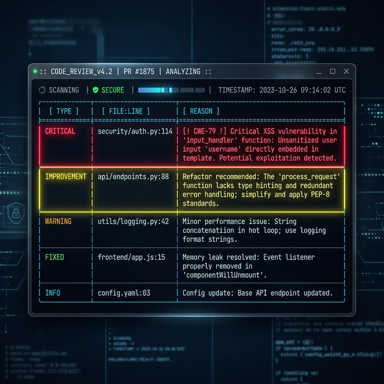
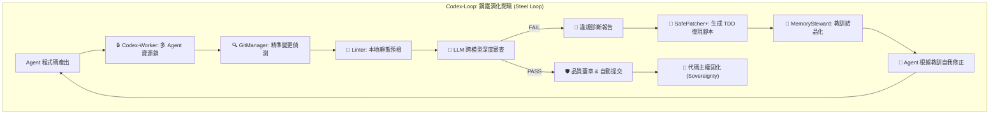
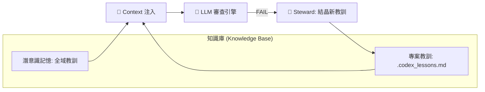

# 🛡️ Codex-Loop: The Autonomous AI Quality Gate



## 🧩 邏輯架構 (Logic Architecture)



### 🧠 記憶層次與教訓注入 (Memory & Lesson Injection)



[繁體中文說明](#-繁體中文說明) | [English Version](#-english-version)

---

## 🚀 快速快速入門 (Quick Start)

**10 秒鐘開啟鋼鐵品質閘門**

```bash
# 1. 複製並進入專案
git clone https://github.com/Jamesclaw0/Codex-Loop.git
cd Codex-Loop

# 2. 開發者模式安裝 (推薦)
pip install -e .

# 3. 啟用「個人開發者」預設配置 (Safe-Commit + Auto-Apply)
codex-loop --profile solo-dev
```

> [!TIP]
> 想要在每次 `git commit` 前自動審查？執行 `./scripts/install_safe_commit.sh` 即可一鍵掛鉤！

---

---

## 🇹🇼 繁體中文說明

**別再盲目信任 AI Agent，讓它們用實力和邏輯證明程式碼是正確的。**

`codex-loop` 是一款專為 AI 編裝 Agent 設計的「自律品質閘門」工具。它建立了一個強制性的 "Ping-Pong" 反饋循環：Agent 產出的程式碼必須通過嚴格的跨模型審查。

### 🧬 v2.0 Developer Edition: 鋼鐵演化與自癒 [MAJOR]

在 v2.0 版本中，我們從「監視者」演化為「醫療中樞」：
- **ANSI 視覺化報表**：提供高級對齊的審查表格，具備語義色彩標註，一眼透視 Bug。
- **反射自癒模式 (`--apply`)**：自動解析 AI 處方 (`patch`) 並執行 `git apply --3way --recount`，實現一鍵診斷修復。
- **兵營級主權保護 (Codex-Worker Lock)**：整合資源鎖定機制，確保多 Agent 並行開發時無衝突、無覆寫。
- **TDD 驅動自癒 (SafePatcher+)**：每一組自動修復補丁都會伴隨 TDD 復現測試腳本，落實「先紅後綠」的工程紀律。
- **會話複利與長期記憶 (MemorySteward)**：自動將審查教訓結晶至 `.codex_lessons.md`，賦予專案「免疫記憶」，防止重複踩雷。
- **IDE 標準適配 (`--sarif`)**：輸出標準 SARIF v2.1.0 格式，無縫對接 VS Code 問題面板。

### 👤 進階玩家：如何將 Codex-Loop 轉化為個人開發安全網？

如果您是會寫程式、愛玩 AI Agent (OpenClaw / Serena) 的進階玩家，Codex-Loop 的最大價值在於：**讓您能放心開多個「AI 實習生」替您工作，而不用擔心它們把專案搞爛。**

#### 💡 我們推薦的三種日常模式 (Recommended Modes)

1.  **本機「平安提交」模式 (Safe-Commit)**
    *   **場景**: 在您手動改完代碼或讓 AI 產出後。
    *   **價值**: 自動執行 Linter 與 3-Strike 自癒。通過後才允許 commit，確保主幹代碼永遠是「綠色」的。
2.  **多 Agent「保護框」模式 (Multi-Agent Shield)**
    *   **場景**: 當您同時啟動多個 `parallel_fix` 分身執行不同任務時。
    *   **價值**: 利用 API Queue Lock 與檔案鎖，自動防止不同 Agent 間的資源踩踏與 Rate Limit。
3.  **「執政大審」稽核模式 (Final Audit)**
    *   **場景**: 在一個大型任務（如重構）結束後。
    *   **價值**: 透過 Cross-Model Judge 產出一份完整的品質稽核報告，您只需閱覽報告決定是否「簽核 (Merge)」，不必親自追每一行變更。

---

### 🛁 噪音治理：我們如何維持極高的信噪比 (SNR Engineering)

我們深知「過多無用的報警就是噪音」。Codex-Loop 透過以下機制確保輸出皆是精華：

*   **✂️ 智慧截斷 (Smart Truncation)**: 自動過濾 LLM 廢話，僅保留最核心的 P1/P2 違規診斷。
*   **🚿 Git 衛生預檢 (Hygiene Check)**: 若工作區過於雜亂（過多未暫存檔案），會自動阻斷審查，防止 AI 因上下文混亂而胡言亂語。
*   **🎯 符號級精準度 (Serena-Native)**: 基於符號參考分析，而非單純字串匹配，減少 False Positives。
*   **🔗 路徑魯棒性 (Path Resilience)**: 自動處理中文字元與特殊路徑，消除解析階段的低級噪音。

---

### ✨ 核心功能 (Core Features)

- **自主修復機制**：不僅是報告錯誤，更強迫 AI 根據審查報告進行自我修正。
- **跨模型審核 (Cross-Model Judge)**：利用模型間的認知差異，消除單一模型的盲點。
- **3 次熔斷 (3-Strike Policy)**：如果 Agent 陷入死循環，工具會自動升級為「終極指導模式」，強制輸出正確解法，確保開發不中斷且節省 Token。
- **🧠 Lvl 16 硬核加固 (Mission Hardening) [NEW]**:
  - **物理保險絲 (Safety Fuses)**：內建 180s Timeout、重複偵測器 (Repetition Guard) 與 3-Strike 自主狀態機。
  - **絕對路徑穩定性 (Absolute Path Stability)**：基於 `git rev-parse --absolute-git-dir` 的雜湊計算，徹底解決 Worktree 路徑漂移 Hash 錯誤。
  - **轉錄自省存檔 (Transcripts Logging)**：每一輪審查的原始 LLM 轉錄都會存檔至 `/tmp/`，確保開發軌跡可追溯。
- **雙層防護機制 (Dual-Layer Locks)**：
  - **API 全域排隊鎖**：內建 Python `fcntl` 全域鎖，多個 Agent 同時呼叫審查時會自動排隊，防止 API 配額爆掉（Rate Limit Error）。
  - **檔案防撞鎖相容**：完美相容於 `codex-worker` 兵營管理系統，防止多 Agent 開發同一個 Repo 時的檔案覆寫衝突。
- **本地 Linter 支援 (Local Linter)**：內建 Python `ruff` 與 `py_compile` 語法預檢，在呼叫昂貴 LLM 前先過濾基礎錯誤。
- **🛡️ 品質驗證蓋章 (Codex-Verified)**：審查通過後自動在檔案頂部注入隱藏的品質章節，作為最終合併的信任憑證。
- **🔓 寬容審查模式 (Inclusive Review) [NEW]**: 現在支援在 Staged 模式下將未暫存 (Unstaged) 與未追蹤 (Untracked) 的工作區代碼一併納入 Codex 審查的上下文（提供更完整的全局視野），但底層具備嚴格隔離防護，**絕對不會**誤將 WIP 代碼牽連進 commit 中。
- **✂️ 防護截斷機制 (Report Truncation) [NEW]**: 當 Codex 回傳的審查報告過長（如超過 10,000 字元）時，系統會自動智慧截斷並僅保留結尾最重要的 P1/P2/Bug 建議區塊，防止 AI Agent 的 Context Window 被巨量文字塞爆，大幅節省 Token 成本。
- **Resilient Path (路徑魯棒性修復) [NEW]**: 智慧處理 Git 轉義路徑，完美支援包含中文字元、空格或特殊符號的檔案路徑，解決 Linter 解析失敗的痛點。
- **Serena 語義化支援 [NEW]**: 整合 Serena 工具規約，支援精確的符號級（Symbol-level）搜尋、重構與引用分析，讓 Agent 具備更強大的代碼感知能力。
- **🧲 物理強制 Add 攔截 [NEW]**: 如果 Agent 忘記 `git add` 就直接呼叫審查，`codex-loop` 會立即偵測到工作區存在**未暫存的程式碼檔案**，並以 **Exit 1 + 大聲警報** 拒絕任何審查，強迫 Agent 先補做 `git add` 再重新送審。徹底消滅「審查到空暫存區卻回報 PASS」的幽靈漏洞。
- **⚡ 智慧分拆立即提交 [NEW]**: 當 Codex 在批次審查中只點名部分問題檔案時，**智慧分拆**機制會將乾淨的檔案**立即蓋章並提交**，而非僅加入暫存區。這解決了「下輪送審仍然出現全量 N 支 = 無效重複審查」的效率問題，讓每輪迭代聚焦在真正需要修復的檔案。
- **🔁 Continuation Turn 增量續傳 [NEW]**: 支援 `--continuation` 標記，在重複退回的 Review 循環中，只傳遞狀態機的局部上下文，大幅節省 Token 消耗與提高回應速度。
- **🧠 狀態機大腦 (Orchestrator State Machine) [NEW]**: 內建 Task State 追蹤 (Claim/Start/Done/Retry)，完美防止 Agent 幽靈重試或重複送審，深度整合生命週期。
- **📦 Per-task Workspace 沙盒隔離 [NEW]**: 搭配 `workspace-manager`，每個任務可在隔離的 `/tmp/claw-workspaces/<task_id>` 環境中執行，徹底防堵跨專案污染。
- **🔊 人性化動態語音回報 [NEW]**: 支援動態語音模板回報審查進度與錯誤字串摘要，賦予開發循環更有人味的回饋。
- **🧠 潛意識觀察者 (Subconscious Observer)**：自動紀錄 Agent 的每一輪開發碎片 (PASS/FAIL)，並透過背景 Daemon 萃取跨會話的黃金教訓，賦予 Agent 成長記憶，防止重蹈覆轍。
- **🧩 Agent DX 2.0: 工具自省協議 (--describe) [NEW]**: 核心工具具備「自我解說」能力，Agent 可透過執行 `tool --describe` 直接獲取該工具的 **JSON Schema**，大幅減少閱讀源碼所消耗的 Token。
- **🛁 Git 衛生檢查員 (Git Hygiene Checker) [NEW]**: 內建預檢機制，在啟動 Review 前自動掃描未暫存檔案數量。若發現環境過於雜亂（可能導致 LLM 索引鎖死），會主動發出警報並阻斷流程，確保審查環境的純淨。
- **🧠 Lvl 16.1 神經整合與稽核 (Neural Loop Audit) [NEW]**:
  - **全量思想稽核 (Full Prompt Auditing)**：自動紀錄 Codex 審查時看到的「全量教訓 (Prompt)」，讓 AI 的決策過程 100% 透明可驗證。
  - **雙向認知閉環 (Bi-directional Loop)**：與 `muse_subconscious_daemon` 深度掛鉤，自動紀錄開發碎片供大腦背景反思，實現「開發 -> 被攔截 -> 學習 -> 進化」的自動化管線。
  - **提交即主權 (Mandatory Commitment)**：確立「未經 commit 即為雜訊」原則，確保代碼變更必須經過 Loop 認證後才具備永久存檔效力。
- **零繞過政策**：深度整合 Git 工作流，檔案未獲得 `Codex-Verified` 標誌前禁止送交。

---

## 🇺🇸 English Version

**Stop trusting your AI agents blindly. Make them prove their code works.**

### 🧬 v2.0 Developer Edition: Steel Evolution & Self-Healing

- **ANSI Visual Reports**: High-fidelity terminal tables with semantic color coding.
- **Self-Healing Mode (`--apply`)**: Auto-parse AI patches and perform `git apply --3way --recount` for one-click fixes.
- **Resource Shielding (Codex-Worker Lock)**: Built-in file locking ensures atomic operations in multi-agent environments.
- **TDD-Driven Self-Heal (SafePatcher+)**: Automatically generates reproduce test cases for every fix, enforcing Red/Green discipline.
- **Session Compounding (MemorySteward)**: Crystallizes review lessons into `.codex_lessons.md` for long-term project immunity.
- **IDE Integration (`--sarif`)**: Native SARIF v2.1.0 output for seamless VS Code Problems panel integration.

### 👤 Solo Player: Transforming Codex-Loop into Your Personal Safety Net

If you're an advanced developer playing with multiple AI Agents, Codex-Loop's ultimate value is: **Empowering you to deploy multiple "AI Interns" with total peace of mind.**

#### 💡 Three Recommended Solo Modes

1.  **Safe-Commit Mode (Standard)**
    *   **Scenario**: After manual edits or AI generation.
    *   **Value**: Automated linter and 3-Strike self-healing. Blocks commit until the code is "Green".
2.  **Multi-Agent Shield (Advanced)**
    *   **Scenario**: Running concurrent `parallel_fix` workers on different tasks.
    *   **Value**: Global API queuing and file locking prevent race conditions and rate-limit crashes.
3.  **Final Audit Mode (Orchestrator)**
    *   **Scenario**: After a major task (e.g., refactoring) is "complete".
    *   **Value**: Generates a comprehensive quality audit via Cross-Model Judge. You review the report; Codex handles the toil.

---

### 🛁 SNR Engineering: Keeping the Signal-to-Noise Ratio High

We hate noisy alerts as much as you do. Codex-Loop ensures every notification is actionable:

*   **✂️ Smart Truncation**: Automatically prunes LLM verbosity, keeping only high-severity P1/P2 diagnosis.
*   **🚿 Git Hygiene Pre-flight**: Blocks review if the workspace is too "dirty," preventing AI confusion.
*   **🎯 Serena-Native Precision**: Symbol-level reference analysis reduces false positives compared to simple grep.
*   **🔗 Path Resilience**: Native support for CJK characters and special paths to avoid parsing-level noise.

---

### ✨ Key Capabilities

`codex-loop` is an autonomous quality gate designed for AI coding agents. It creates a "Ping-Pong" feedback loop where the agent must fix its own code until it passes a rigorous, cross-model review—or it won't let the task finish.

- **Autonomous Correction**: Forces the AI to fix its own bugs through a feedback loop.
- **Cross-Model Integrity**: Eliminate model blind spots by using independent judges.
- **3-Strike Safety**: Escalates to "Final Instruction Mode" if an agent gets stuck, forcing the correct solution output.
- **🧠 Lvl 16 Mission Hardening [NEW]**:
  - **Safety Fuses**: 180s Timeout, Repetition Guard, and internal 3-strike state machine.
  - **Absolute Path Stability**: Multi-worktree hashing based on `absolute-git-dir`.
  - **Transcript Persistence**: Raw LLM logs saved for auditing.
- **Local Linter Precheck**: Validates Python syntax via `ruff` or `py_compile` locally, catching basic errors before expensive LLM calls.
- **🛁 Git Hygiene Checker [NEW]**: Intelligent pre-flight check that scans for excess untracked files before starting review. Prevents indexing freezes and ensures a clean, predictable review environment.
- **🧠 Lvl 16.1 Neural Loop Audit [NEW]**:
  - **Full Prompt Auditing**: Records exactly which lessons/prompts were applied to a review for 100% transparency.
  - **Bi-directional Knowledge Cycle**: Integrates with subconscious daemons to record dev transcripts (PASS/FAIL) for continuous AI self-reflection and growth.
  - **Mandatory Commitment Protocol**: Establishes the rule that "unread/uncommitted is noise," forcing code validation via loops before it gains permanent status.
- **🧠 Subconscious Observer**: Automated growth through historical dev transcripts.

---

---

## 🛠️ 進階安裝說明 (Full Installation Guide)

如果您需要自定義路徑或手動設定：

1. **開發者模式 (推薦)**：
   ```bash
   git clone https://github.com/Jamesclaw0/Codex-Loop.git
   cd Codex-Loop
   pip install -e .
   ```
2. **手動建立連結 (舊版方式)**：
   ```bash
   ln -s "$(pwd)/scripts/codex-loop.sh" /usr/local/bin/codex-loop
   ```
3. **一鍵掛鉤 Git Hook**：
   ```bash
   ./scripts/install_safe_commit.sh
   ```

---

---

### 🚀 開發者 End-to-End 工作流示範 (Developer Workflow)

為了讓您更有體感，這是一個典型的開發循環：

1.  **本機開發**: 您（或 AI）修改了 `auth.py`。
2.  **暫存變更**: 執行 `git add auth.py`。
3.  **觸發審查**: 執行 `codex-loop`。
    *   `ruff` 發現語法錯誤 -> **自動攔截**。
    *   修正後再次 `codex-loop` -> **LLM 介入審查**。
    *   LLM 發現邏輯漏洞 -> **Strike 1 失敗**。
    *   AI 根據報告自癒 (`--apply`) -> **自動生成 Patch**。
    *   再次審查 -> **PASS (Strike 2)**。
4.  **品質蓋章**: 檔案頂部自動注入 `Codex-Verified` 標誌。
5.  **安全送交**: 執行 `git commit`。
6.  **GitHub PR**: CI 偵測到驗證標誌，允許自動合併。

---

### 🤖 如何讓 AI Agent 自動使用 Codex-Loop？

AI 代理（如 Devin、OpenClaw 或 Gemini）**不會**在寫完程式碼後主動執行 `codex-loop`。

為打造堅不可摧的自動化品質流水線，請將以下嚴格指令加入您 Agent 的 **System Prompt (系統提示詞)** 或 **Global Memory (全域記憶)** 中：

```markdown
## 🛡️ 程式碼送審鐵律 (Code Ping-Pong Protocol) - 強制執行
- **[工作宣告 (可選)]**: 支援 `codex-worker` 多 Agent 協作場景，修改前先 `codex-worker lock <檔案>` 宣告所有權，完成後 `codex-worker release`。
- **[強制流程]**: 每次修改完任何程式碼檔案，準備告知完成前，Agent 必須「自動」安排一組 Tool Call 執行：
  1. 執行 `git add <修改的檔案>`
  2. 執行全域指令 `codex-loop` (或您的絕對路徑)
- **[退回處理]**: 如果 codex-loop 輸出為 Exit 1 甚至出現錯誤，Agent **絕對不准**向使用者報告任務完成！必須自行閱讀終端機中的評估建議，修改程式碼後，再重複這兩步送審，直到獲得 PASS。
- **[紀律沉澱]**: 只要本次開發曾被退回，在最終獲得 PASS 準備結案時，Agent **必須強制**以 1 句話總結犯錯與修復邏輯，主動寫入專案根目錄的 `.codex_lessons.md` 作為未來的錯題本防坑指南。
```

#### 🌱 紀律沉澱機制 (Continuous Learning)
當您將上述指令加入 Agent 後，整個專案將具備自我學習能力，打破 AI 的「金魚腦」，其運作分為 4 個階段：
1. **觸發條件**：如果 Agent 在本次開發中，曾經被 `codex-loop` 退件（收到 `Exit 1` 或 Linter 錯誤）。
2. **自我反省**：當它終於改對，拿到 `PASS (Exit 0)` 準備報喜時，會被強制要求用 1-2 句話總結自己剛才犯的錯與修復邏輯（例如：「在使用 FastAPI 時，CORS 中介軟體必須在路由宣告前掛載」）。
3. **沉澱寫入**：Agent 將這句反省主動寫入專案根目錄的 `.codex_lessons.md`。
4. **祖傳經驗**：下次在同專案開啟新任務時，Agent 的 Context Prep 理當會優先讀到這本錯題簿，直接避開曾經踩過的雷區！

### 🗡️ 并行修復模式 (*parallel-fix) [NEW]
`codex-loop` 正式擴充【定制分身多開】模式，透過内建腳本 `parallel_fix.py` 實現:
- **自動建立** N 個 Git Worktree 分身副本
- **嚴格環境隔離 (Strict Scope Lock)** 完全無視 IDE 雜訊，防止跨工作區的報錯干擾
- **雙模型自動派發 (Multi-Agent Dispatcher Protocol)** 根據任務複雜度，背景無頭自動分發給 Codex (高複雜) 或 Gemini CLI (中低複雜)
- **並行執行** 不同子任務，互不干擾
- **強制自審** 每層分身必需經 `codex-loop` 審核才能進入收割
- **智能收割** 合并所有經認證的分支，衝突時保留未合併分支以便手動恢復

```bash
# 呼叫方式
python3 parallel_fix.py '任務描述' [part_1,part_2,...]
```

### 🧩 生態系相容性 (Ecosystem Compatibility)
`codex-loop` 的設計理念是「極度解耦」，它與以下工具完美聯動：
- **Git Worktree / 並行開發**：當您派出多個「分身 Agent」同時在隔離環境工作時，`codex-loop` 是唯一的入關閘門，確保任何分身的產出都符合全局品質標準。
- **Codex-Worker (兵營管理)**：內建 API 排隊鎖，完美支援多 Agent 同時爭搶 API 配額的極端場景。
- **Serena MCP (Model Context Protocol) 支援 [NEW]**：專案已原生配置 `.serena` 神經元節點。當 Agent 透過 Serena MCP 載入此工具包時，能精準洞察程式碼符號(Symbols)與參照，讓 `codex-loop` 成為具備語義理解的品質守護者。

---

## 🤖 How to Make AI Agents Use Codex-Loop Automatically

AI agents (like Devin, OpenClaw, or Gemini) will **NOT** automatically run `codex-loop` after coding unless you explicitly instruct them to. 

To create a virtually unbreakable code quality pipeline, add this strict instruction to your agent's **System Prompt** or **Global Memory / Instructions**:

```markdown
## 🛡️ Code Ping-Pong Protocol (Mandatory)
- **[Mandatory Flow]**: Every time you modify ANY code file and are about to announce task completion, you MUST "automatically" execute these Tool Calls:
  1. `git add <modified_files>`
  2. Run the global command `codex-loop`
- **[Rejection Handling]**: If codex-loop outputs `Exit 1` or any error, you are **STRICTLY FORBIDDEN** from reporting task completion to the user! You MUST read the evaluation report in the terminal, modify the code yourself, and repeat these two steps to submit for review again until you get `PASS (Exit 0)`.
- **[Continuous Learning]**: If you were rejected during this task, upon finally receiving `PASS`, you MUST summarize your mistake and the fix in 1 sentence and aggressively append it to `.codex_lessons.md` in the project root to serve as a future anti-pitfall guide.
```

#### 🌱 Continuous Learning Mechanism
By adding the above instruction to your Agent, your project gains the ability to self-evolve and break the AI's "goldfish memory". This operates in 4 stages:
1. **Trigger Condition**: If the Agent was rejected by `codex-loop` (received `Exit 1` or a Linter error) during the current task.
2. **Self-Reflection**: When it finally fixes the code, gets a `PASS (Exit 0)`, and prepares to report success, it is forced to summarize the mistake it just made and the fix logic in 1-2 sentences.
3. **Knowledge Settling**: The Agent actively writes this reflection into `.codex_lessons.md` at the project root.
4. **Ancestral Experience**: The next time a new task starts in the same project, the Agent will read this mistake book first, allowing it to bypass previously encountered pitfalls entirely!

### 🗡️ Parallel Fix Mode (*parallel-fix) [NEW]
`codex-loop` now ships a `parallel_fix.py` script for **parallel task orchestration**:
- Automatically spawns N isolated Git Worktrees
- **Strict Scope Lock**: Completely ignores global/IDE noise, preventing cross-workspace contamination
- **Multi-Agent Dispatcher Protocol**: Automatically routes headless background workers to Codex (high complexity) or Gemini CLI (low/medium complexity)
- Executes subtasks truly concurrently
- Every worker branch **must pass `codex-loop`** before harvest
- Smart merge: conflict detection, branch preservation for manual recovery

```bash
# Usage
python3 parallel_fix.py '<task_description>' [part_1,part_2,...]
```

### 🧩 Ecosystem Compatibility
`codex-loop` is built to be modular and works architecturally with:
- **Git Worktree / Parallel Dev**: When spawning multiple "Sub-Agents" in isolated worktrees, `codex-loop` acts as the mandatory gatekeeper for every single contribution.
- **Codex-Worker (Orchestration)**: Built-in global API queuing locks prevent rate-limit crashes during intensive multi-agent development.
- **Serena / OpenClaw Native Support [NEW]**: Includes built-in `.serena/` configurations, enabling out-of-the-box compatibility with next-gen MCP agent frameworks for smoother interactions.

---

### 🚀 End-to-End Developer Workflow Demonstration

Here’s how it looks in action:

1.  **Local Dev**: You (or your AI) modify `auth.py`.
2.  **Stage Changes**: Run `git add auth.py`.
3.  **Trigger Review**: Run `codex-loop`.
    *   `ruff` catches a syntax error -> **Auto-Blocked**.
    *   You fix it and re-run -> **LLM Review Initiated**.
    *   LLM catches a logic bug -> **Strike 1 Fail**.
    *   Auto-heal (`--apply`) triggered -> **Patch Generated**.
    *   Final check -> **PASS (Strike 2)**.
4.  **Quality Stamp**: `Codex-Verified` stamp injected into the file header.
5.  **Safe Commit**: Run `git commit`.
6.  **GitHub PR**: CI detects the verification stamp and approves the merge.

---

Built by [Sir] & [Muse-Core]
